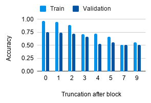

# stylegan-detector

A reimplementation of [What Makes Fake Images Detectable? Understanding Properties that Generalize](https://arxiv.org/pdf/2008.10588.pdf)

By [Nam Do](https://ndo3.github.io) '21, Julia Windham '21, and Esmeralda Montas '21 - Brown University

### Overview
We sought to reimplemented the Xception model from stractch and train it to classify image data into two classes
'real' or 'GAN-generated'. Unlike the aforementioned paper, we used this [Dataset of 140,000 Images with a binary label of real/fake](https://www.kaggle.com/xhlulu/140k-real-and-fake-faces) from Kaggle. We also defined a 10GB constraint. Using different points of trunctions we achieve the following results presented in the graph.

  
                          
### Download Data and Formatting

- If you do not have the kaggle api installed your machine please follow [this helpful guide](https://medium.com/@ankushchoubey/how-to-download-dataset-from-kaggle-7f700d7f9198). 
- Next, in this project directory run `mkdir data` and then `cd data`
- Then retrieve the data by: `kaggle datasets download -d xhlulu/140k-real-and-fake-faces`.
- Once downloaded, configure the data using the following commands in your data 

                 mv /real-vs-fake/real-vs-fake/train/fake . 
                 mv /real-vs-fake/real-vs-fake/train/real .
                 mv /real-vs-fake/real-vs-fake/test/fake .
                 mv /real-vs-fake/real-vs-fake/test/real .
                 mv /real-vs-fake/real-vs-fake/valid/fake .
                 mv /real-vs-fake/real-vs-fake/valid/real .
                 rm -r real-vs-fake

- After these instructions are run the data is configure for use with out model.

### Folder structure & Running instructions

We used the following:
- Python version: 3.8.5

The data is not pushed onto the repository. In order to replicate our code, do the following:

1. Follow the link to the aforementioned dataset, and unzip them to `data` such that the folders `train`, `test`, and `valid` are in `data` (e.g. `/data/train`, `/data/test`, `data/valid`)

### Run Commands

The model could be run with the follow commands:

  - python run.py --trunctcate_block_num <[0-9]> --data_path <NONE> --percent_of_data <[5-15]

In testing we used this command:
  - python run.py --tructcate_block_num<[0-9]> --percent_of_data 5
